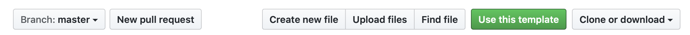

# Typescript NPM Library Starter

Starter for a NPM package build with TypeScript goodness 🚀

Check the [example NPM package](https://www.npmjs.com/package/typescript-npm-library-starter) based on this repo.

## How to use

If you want to create a small or big JavaScript/TypeScript library to push it to NPM (or other platform). You don't want to worry about setting up a development environment and just want to start building as soon as possible.

This repo is a template for your library and ready to publish on NPM.



Just click on the green button to create your repo based on this one. It's just that easy 👍

Clone it to your computer, run `npm install` and start building!

## Requirements

- TypeScript >= v3.7.4
- NodeJS >= v13.3
- NPM >= v6.13.6

## Workflow

1. Build your functionality
2. Run a build with `npm run build`
3. Commit changes
4. Create a git tag
5. Run `npm run version` to push all commits and tags
6. Run `npm publish` to run all linting, formatting, build and publish it on NPM

## Dependencies

### Generate recommended documentation/files to improve contribution

The following files are generated by the [CGX CLI](https://github.com/jeroenouw/cgx).

Run `npm run cgx` to start the CLI.

- CODE_OF_CONDUCT.md
- CONTRIBUTION.md
- .github/
  - ISSUE_TEMPLATE
  - PULL_REQUEST_TEMPLATE

CGX offers options for Github, Gitlab, Bitbucket and will expand in future versions.

### TypeScript Type Coverage

For checking the type coverage in TypeScript, we used the [TSCOV CLI](https://github.com/jeroenouw/liftr-tscov) by the Liftr framework.

Run `npm run tscov` to check your types.

### Code formatting

To make sure that everyone, who works on your library formats it's code equally, we included [TSlint](https://palantir.github.io/tslint/) with a plugin for [Prettier](https://prettier.io/).

In the `.prettierrc` you can change the settings to your preferences.

### Testing

For running tests against your code we included [Jest](https://jestjs.io/). Jest is a JavaScript/TypeScript testing framework with a focus on simplicity, that's why we like it so much!

Run `npm run test` for 1 time only run. If you want to use the Jest watch option, run `npm run test:watch`.

## Example readme content

## Installation

```bash
npm install typescript-npm-library-starter
```

## How to

```javascript
import { Car } from 'typescript-npm-library-starter';

const car = new Car();

// add more of the example here
```
